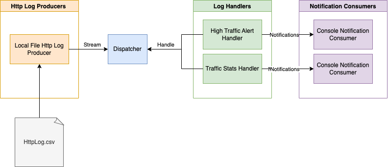

# Solution design overview

The System contains 4 major components:

* Http Log Producer - Component for producing logs from different sources. Producer stream logs one row by one, so does
  not keep all in memory. Each producer can be run in the background mode. Possible log sources:
    * Local file
    * Agent for collecting logs
    * Cloud storage
* Dispatcher - Component for other component's lifecycle management. The component starts background processes and
  applies producer-consumer workflow, where for each log line of Producers stream(producer), the handle method for each
  Handler is called(consumer).
* Log handler - Core components of the system. Each handler runs independently in the background mode. That allows to
  isolate logic for different handlers. Each log can produce notifications based on the specific logic for different
  notification consumers. For example, statistical information can be directed to Grafana and high traffic alerts can be
  directed to Alert Management System.
* Notification Consumer - Component for consuming notifications from log handlers. Each consumer can be run in the
  background mode and send notifications to different systems.

## Handlers logic

### High Traffic Alert Handler

State for the handler is log queue. When a log line is handled, it is added to the queue. If the size of the queue is greater
than the limit high traffic notification is generated. Then all logs which are older than current log time -
TIME_INTERVAL are deleted from the queue. To avoid notification duplicates, the current status of the queue is saved.

### Traffic Stats Handler

State for the handler is different aggregation functions for given period:
1. Maximum value of request bytes.
2. Sum of all request bytes.
3. Number of different request status codes according to template: 2xx, 4xx, 5xx or others
4. Number of different request methods.
5. Number of different website sections.

When a log line is handled, state is updated by the following rules:
1. Maximum = max(Maximum, current value)
2. Sum += current value
3. Number += 1 (counter is increased by one)

if the time period is ended, state is reset to default values.